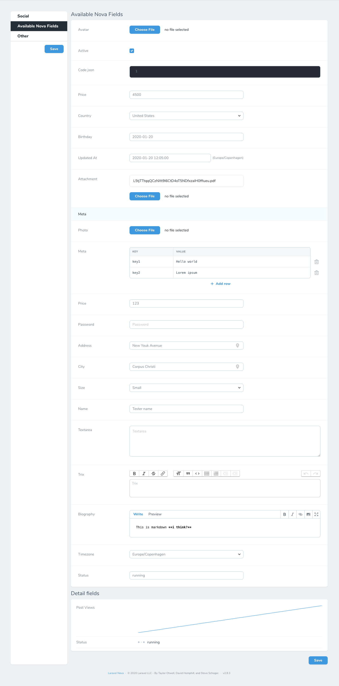

Laravel Nova tool to manage app settings
========================================

[](https://packagist.org/packages/Andreasgj/nova-settings-tool)
[](https://packagist.org/packages/Andreasgj/nova-settings-tool)
[](https://github.com/Andreasgj/nova-settings-tool/actions)
[](https://github.styleci.io/repos/165178010)
[](https://opensource.org/licenses/MIT)

Store and edit simple app-wide settings right in Nova. Settings are stored as JSON using [`spatie/valuestore`](https://github.com/spatie/valuestore), making them really easy to [pull in and use everywhere else in your app](https://laravel-news.com/global-application-settings).


## Installation

Install the package via Composer in any Laravel app using [Nova](https://nova.laravel.com):

```shell
composer require andreasgj/nova-settings-tool
```

Publish the default configuration file to `config/nova-settings-tool.php`:

```shell
php artisan vendor:publish --tag="nova-settings-tool"
```

Register the tool with Nova in the `tools` method of your `NovaServiceProvider`:

```php
// in app/Providers/NovaServiceProvider.php

use Andreasgj\NovaSettingsTool\SettingsTool;

    // ...

    public function tools()
    {
        return [
            new SettingsTool,
        ];
    }
```

## Usage

Settings are declared in a `nova-settings-tool.php` config file. This file specifies where settings are stored, what the tool’s title is in Nova’s sidebar, the layout of the settings page, and metadata about the settings themselves.

A [default config file with some helpful examples](config/nova-settings-tool.php) is included as a starting point:

Each item in the `panels` array is a panel which contains Nova’s fields. Panels can also shown as a sidebar instead, so if you have a lot of settings, then you don't need to scroll through it all.



The settings’ actual values are stored as JSON at the location specified in the config file—`storage/app/settings.json` by default.

You can use all the Nova fields which isn't a relationship field **except**:

- Badge - Seems like it needs a relationship to a resource.
- Boolean Group - Seems like it needs a relationship to a resource.
- Gravatar - Needs a relationship with a resource.
- ID - Needs a relationship with a resource.

All strings in this package, and any you pass to it, can easily be translated using [Laravel’s built-in localization features](https://laravel.com/docs/localization#using-translation-strings-as-keys).

## Get the stored configs?

We have now added a simple way to get the configs you need. Here is the following global functions you can use:

```
/**
 * This function will return key value of the configs specified in the $keys array.
 */
function get_store_configs(array $keys = []): Object

/**
 * This function will return the value of the config specified in the $key string.
 */
function get_store_config(string $key): mix

/**
 * This function will return Laravel\Nova\Fields\Field of the config specified in the $attribute string.
 */
function get_store_config_field(string $attribute): Laravel\Nova\Fields\Field

/**
 * This function will return a collection of all the fields setup in the config file.
 */
function get_store_config_fields(): collect

/**
 * This function will return a collection of all the panels setup in the config file.
 */
function get_store_config_panels(): collect
```

## Roadmap

The following features are planned or in development:
- ?

---

[CHANGELOG](CHANGELOG.md) • [CONTRIBUTING](CONTRIBUTING.md) • [LICENSE](LICENSE.md)
