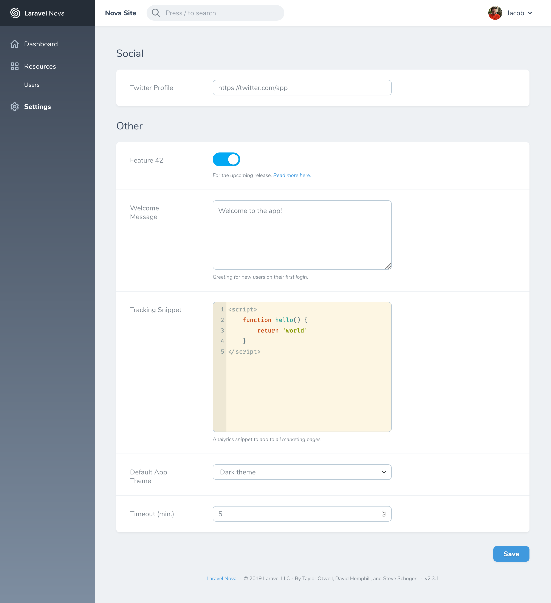

A Laravel Nova tool to manage app settings
==========================================

[](https://packagist.org/packages/bakerkretzmar/nova-settings-tool)
[](https://packagist.org/packages/bakerkretzmar/nova-settings-tool)
[](https://opensource.org/licenses/MIT)
[](https://github.styleci.io/repos/165178010)<!-- Coverage?? -->

Store and edit simple app-wide settings right in Nova. Settings are stored as JSON using [`spatie/valuestore`](https://github.com/spatie/valuestore), making them really easy to [pull in and use everywhere else in your app](https://laravel-news.com/global-application-settings).



## Installation

Install the package in any Laravel app that uses [Nova](https://nova.laravel.com) via composer:

```bash
composer require bakerkretzmar/nova-settings-tool
```

Publish the included default configuration file to `config/settings.php` (optional, see below):

```bash
php artisan vendor:publish --tag="settings-tool"
```

Register the tool with Nova in the `tools` method of your `NovaServiceProvider`:

```php
// in app/Providers/NovaServiceProvider.php

use Bakerkretzmar\SettingsTool\SettingsTool;

// ...

public function tools()
{
    return [
        new SettingsTool,
    ];
}
```

## Usage

Settings can be declared using a `settings.php` file in your app's `config` folder. This file lets you specify where your settings are stored, what the tool's title is in Nova's sidebar, the layout of the settings page, and information about the settings themselves.

This package includes a default config file that you can publish and use as a starting point:

```bash
php artisan vendor:publish --tag="settings-tool"
```

The [default config](config/settings.php) contains examples that should be pretty self-explanatory, and lots of comments in case they aren't.

Each item in the `panels` array is rendered as its own 'group' of settings, like a panel on one of Nova's detail views. Each panel has a name and contains some settings. Each setting can optionally have a description and a link to more information (e.g. docs). Only the setting's key and value are actually stored in your `settings.json` file.

There are four available setting types:

| Type...    | ...displays            |
| :--------- | :--------------------- |
| `toggle`   | Boolean                |
| `text`     | Single-line text input |
| `textarea` | Multi-line text input  |
| `code`     | Code snippet editor    |
| `file`     | Single file input      |

All the strings hard-coded in this package (like in the "Save" button), as well as any you pass to it (like the `name` of any of your settings), can easily be translated using [Laravel's built-in localization features](https://laravel.com/docs/localization#using-translation-strings-as-keys).

## Testing

```bash
composer test
```

I'm new to testing and would welcome testing-related PRs.

## Changelog

Please see the [CHANGELOG](CHANGELOG.md) for information about what has changed recently.

## Contributing

Please see [CONTRIBUTING](CONTRIBUTING.md) for details.

## Security

If you discover any security related issues, please email <jacobtbk@gmail.com> instead of using the issue tracker.

## License

This package is licensed under the MIT License (MIT). Please see the [LICENSE](LICENSE.md) for details.
