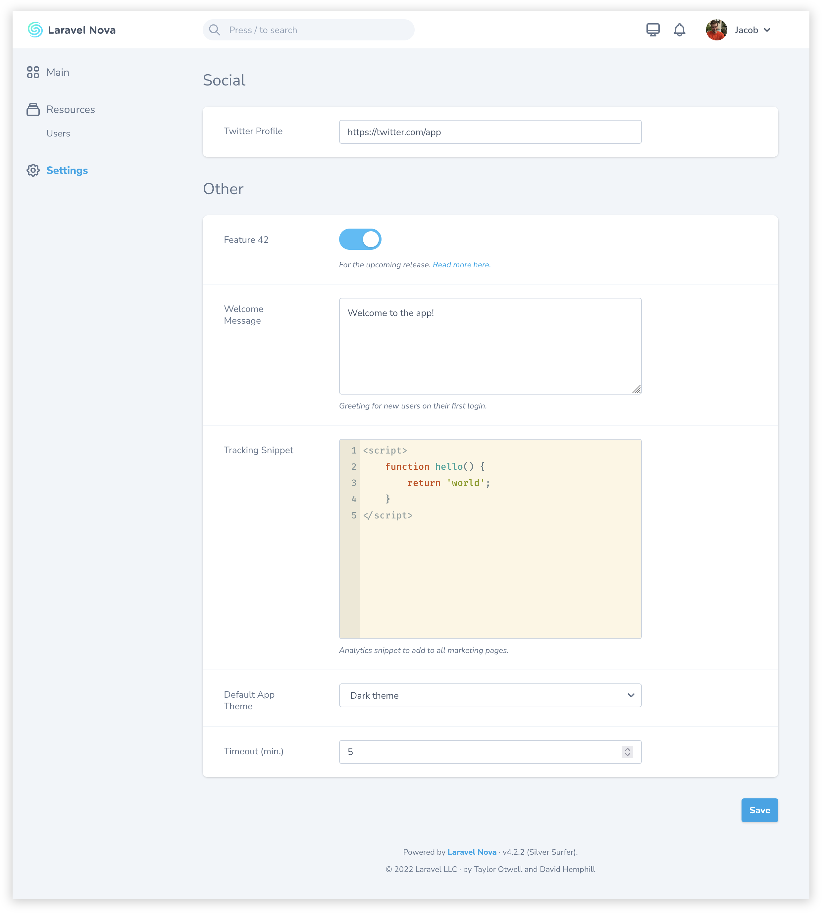

Laravel Nova tool to manage app settings
========================================

[](https://packagist.org/packages/bakerkretzmar/nova-settings-tool)
[](https://packagist.org/packages/bakerkretzmar/nova-settings-tool)
[](https://github.styleci.io/repos/165178010)
[](https://opensource.org/licenses/MIT)

Store and edit simple app-wide settings right in Nova. Settings are stored as JSON using [`spatie/valuestore`](https://github.com/spatie/valuestore), making them really easy to [pull in and use everywhere else in your app](https://laravel-news.com/global-application-settings).



## Installation

Install the package in any Laravel app using [Nova](https://nova.laravel.com), via Composer:

```shell
composer require bakerkretzmar/nova-settings-tool
```

Publish the default configuration file to `config/nova-settings-tool.php`:

```shell
php artisan vendor:publish --tag="nova-settings-tool"
```

Register the tool with Nova in the `tools` method of your `NovaServiceProvider`:

```php
// in app/Providers/NovaServiceProvider.php

use Bakerkretzmar\NovaSettingsTool\SettingsTool;

    // ...

    public function tools()
    {
        return [
            new SettingsTool,
        ];
    }
```

## Usage

Settings are declared in a `nova-settings-tool.php` config file. This file specifies where settings are stored, what the tool's title is in Nova's sidebar, the layout of the settings page, and metadata about the settings themselves.

A [default config file with some helpful examples](config/nova-settings-tool.php) is included as a starting point:

Each item in the `settings` array is rendered as an input with a label and help text, similarly to one of Nova's fields. Optionally, settings can be grouped into panels to separate them visually.

The settings' actual values are stored as JSON at the location specified in the config file—`storage/app/settings.json` by default.

There are currently six available setting types:

- `text`: Single-line text input
- `textarea`: Multi-line text input
- `toggle`: Boolean switch
- `code`: [CodeMirror](https://codemirror.net/) text editor
- `number`: Number input
- `select`: Single-select dropdown

All strings in this package, and any you pass to it, can easily be translated using [Laravel's built-in localization features](https://laravel.com/docs/localization#using-translation-strings-as-keys).

## Roadmap

The following features are planned or in development:

- `color` setting type
- `date` setting type
- `file` setting type

---

[CHANGELOG](CHANGELOG.md) • [CONTRIBUTING](CONTRIBUTING.md) • [LICENSE](LICENSE.md)
